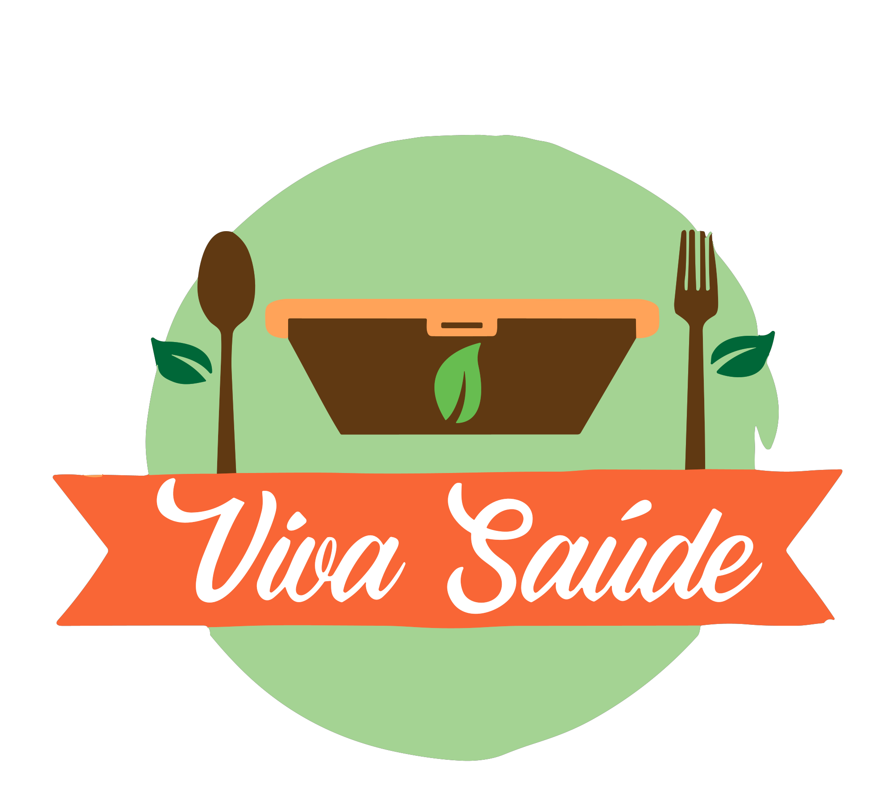
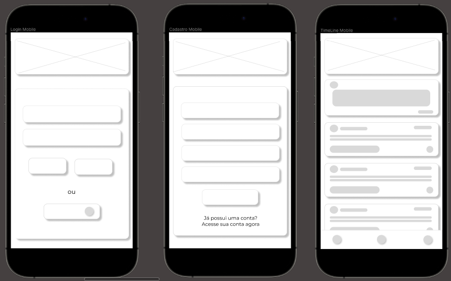
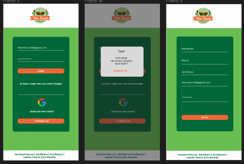
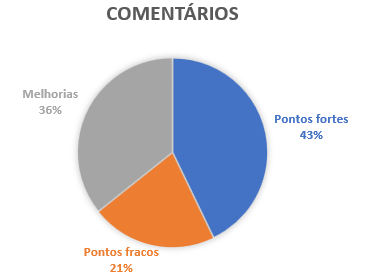
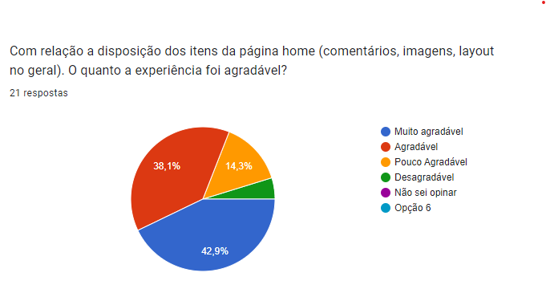
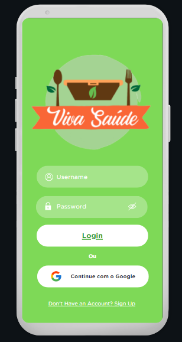

## Índice

* [1. Sobre o projeto](#1-sobre-o-projeto)
* [2. Tema e Usuário](#2-tema-e-usuario)
* [3. Histórias de usuário e critérios de aceitação](#3-histórias-de-usuario-e-criterios-de-aceitacao)
* [4. Protótipo de baixa fidelidade](#4-prototipo-de-baixa-fidelidade)
* [5. Protótipo de Alta fidelidade Vs1](#5-protótipo-de-alta-fidelidade-vs1)
* [6. Teste de usabilidade e resultados](#6-teste-de-usabilidade-e-resultados)
* [7. Protótipo de Alta fidelidade Vs2](#7-protótipo-de-alta-fidelidade-vs2)
* [8. Critérios de aceitação mínimos do projeto](#8-criterios-de-aceitação-mínimos-do-projeto)
* [9. Testes unitários](#9-testes-unitarios)
* [10. Tecnologias aplicadas](#10-tecnologias-aplicadas)
* [11. Resultado Final](#11-resultado-final)
* [12. Desenvolvido por:](#12-entrega)

***

   

## 1. Sobre o projeto

A Viva saúde é um projeto de desenvolvimento de uma aplicação de redes sociais, que faz parte do Bootcamp da Laboratória, com o objetivo de trocas rápidas de receitas saudáveis e dicas de bem estar e saúde. 
Seu objetivo é aprimorar e desenvolver habilidades técnicas e de desenvolvimento de software vontado ao front-end. Além de competências interpessoais em squads e trabalho em equipe.

## 2. Tema e Usuário

A ideia para este produto nasceu a partir da identificação de uma lacuna no mercado de redes sociais voltadas para alimentação saudável. Ao analisar as tendências de saúde, nutrição e estilo de vida, percebeu-se que muitas pessoas estão buscando maneiras de adotar uma dieta mais equilibrada e saudável, mas enfrentam dificuldades para encontrar receitas confiáveis e acessíveis de forma rápida e fácil. 

## 3. Histórias de usuário e critérios de aceitação

1. Login usuário existente
2. Login usuário inexistente
3. Cadastro de usuário
4. Explorando o feed (time Line)
5. Usuário logado: curtir, descutir, criar post, editar post e deletar.

<a href="./src/img/ui.pdf" target="_blank"> Documento completo</a>

## 4. Protótipo de baixa fidelidade

## 5. Protótipo de Alta fidelidade Vs1

<a href="https://www.figma.com/proto/nVcr69GfJRnheHFSWDHOGV/Redes-Sociais?type=design&node-id=71-3&t=KYOfdIAcGbPRhEWK-0&scaling=min-zoom&page-id=0%3A1&starting-point-node-id=71%3A3" target="_blank"> Protótipo de Alta Fidelidade Vs1 </a>

## 6. Testes de usabilidade e resultados

Nosso teste de usabilidade apontou alguns pontos a melhorar, o que nos levou a criar uma segunda versão do protótipo. Com uma amostragem de 21 usuários, tivemos uma boa aceitação, porém algumas sugestões bem relevantes quanto as cores.

## 7. Protótipo de Alta fidelidade Vs2

Baseado nos resultados dos testes chegamos a versão final do projeto. 

<a href="https://www.canva.com/design/DAFtJ8Yn5G4/mA-gaEUdfzdqERQrRX59gg/view?mode=prototype#p-gina-sem-nome" target="_blank"> Protótipo de Alta Fidelidade Vs2 - Mobile </a>

<a href="https://www.canva.com/design/DAFs87DKgZo/pQn7zV3X9Oo9-tuUmW_fxA/view?mode=prototype#p-gina-sem-nome" target="_blank"> Protótipo de Alta Fidelidade Vs2 - Desktop </a>

## 8. Critérios de aceitação mínimo do projeto:
* Boilerplate
* Histórias de usuários
* SPA 
* Ser responsivo
* Testes unitátios
* Testes manuais
* Testes de usabilidade e incorporar o feedback dos usuários como melhorias.
* Fazer deploy do aplicativo e marcar a versão (git tag).

## 9. Testes unitários
Os testes de unidade devem cobrir no mínimo 70% de statements, functions, lines e branches.

imagem

## 10.Tecnologias aplicadas

* [✓] GitHub
* [✓] Git Bash
* [✓] Firebase
* [✓] Vite
* [✓] Visual Studio Code
* [✓] Figma e Canvas
* [✓] HTML
* [✓] JavaScript
* [✓] CSS

## 11. Resultado Final

 
 Página em funcionamento 

 
 https://sap011-redes-sociais.web.app 

## 12. Desenvolvido por:

  
   
    <a href="https://github.com/ribeirober1208">Alessandra Ribeiro</a>
   
  
    <a href="https://github.com/anabfer">Ana Beatriz</a>
    
 
   <a href="https://github.com/belatenorio">Isabela Tenório</a>
    
 
  <a href="https://github.com/irixalmeida">Iris Almeida</a>
   

